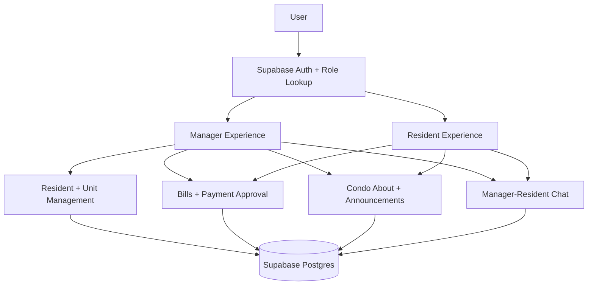

# myCondo

myCondo is a Flutter condo management app for property managers and residents. It uses Supabase for authentication, PostgreSQL data storage, and role-based access to condo, billing, resident, announcement, and messaging data.

## Group Members

- Kent Francis Genilo
- Angel May Janiola
- Jasmine Magadan
- Eleah Joy Melchor
- Mae Maricar Yap

## Current App State

### Manager Side

- Dashboard with manager greeting, summary cards, highlighted announcements, and quick actions.
- Resident management with unit grouping, resident profiles, add/edit/vacate flows, and resident detail pages.
- Bill creation for selected residents or units.
- Per-resident bill management from resident details.
- Announcements with create, edit, delete, and category styling.
- Payment approval queue backed by Supabase:
  - pending resident payment submissions
  - approve confirmation before applying payment
  - deny flow requiring a rejection reason
  - approved payments update bill status to `partial` or `paid`
- Transaction history showing processed payments, both approved and denied.
- Inbox/chat entry point for manager-resident conversations.
- Editable condo About page:
  - condo image
  - condo name and location
  - description
  - gallery image URLs

### Resident Side

- Resident dashboard with a GCash-style amount due summary.
- Resident metrics for open bills, next due date, and overdue bills.
- Payment breakdown sheet from dashboard.
- Pay bill flow:
  - amount
  - proof of payment link/reference
  - optional remark
  - submitted payments wait for manager approval
- Resident bill cards show pending payment status and denial reason when applicable.
- Transaction history showing paid bills only.
- Read-only announcements page.
- Manager chat entry point.
- Read-only condo About page.
- Resident profile and logout.

## Tech Stack

- Flutter
- Dart
- Supabase Auth
- Supabase Postgres
- Supabase Row Level Security

## Setup

1. Install Flutter and Android tooling.
2. Use a supported JDK for Android builds, preferably JDK 17.
3. Create a `.env` file from `.env.example`.
4. Add your Supabase values:

```env
SUPABASE_URL=your_supabase_project_url
SUPABASE_ANON_KEY=your_supabase_anon_key
```

5. Install dependencies:

```bash
flutter pub get
```

6. Run the app:

```bash
flutter run
```

## Supabase Migrations

Migration files live in:

```text
supabase/migrations/
```

Current migrations:

- `20260501000200_payment_approval_policies.sql`
  - allows resident pending payment submissions
  - allows residents to read their payment attempts and rejection reasons
  - allows managers to read and review condo payments
  - makes `payments.validated_by` nullable for pending resident submissions

- `20260501000300_condo_about_fields.sql`
  - adds About page fields to `condos`
  - adds read access for managers/residents in the condo
  - adds manager update access for the condo About page

Apply these in the Supabase SQL editor or through your preferred migration flow before testing the related app features.

## Important Payment Status Values

The app expects `payments.status` to use:

- `pending` - submitted by resident, waiting for manager review
- `completed` - approved by manager and counted toward bill balance
- `rejected` - denied by manager, with `rejection_reason`

Bill status uses:

- `unpaid`
- `partial`
- `paid`

## Project Structure

```text
lib/
  app.dart
  main.dart
  data/
    models/
      manager/
      shared/
    repositories/
      auth/
      manager/
      onboarding/
      resident/
      shared/
  features/
    auth/
    manager/
      pages/
      widgets/
    resident/
      pages/
    shared/
      pages/
      widgets/
  services/
    shared/
  utils/
```

## Architecture

The app follows a feature-first structure with a shared data layer:

- `features/` contains role-specific and shared UI.
- `data/models/` contains Dart models for Supabase rows.
- `data/repositories/` contains Supabase queries and mutations.
- `services/` contains cross-feature services such as chat.

## Logical View


