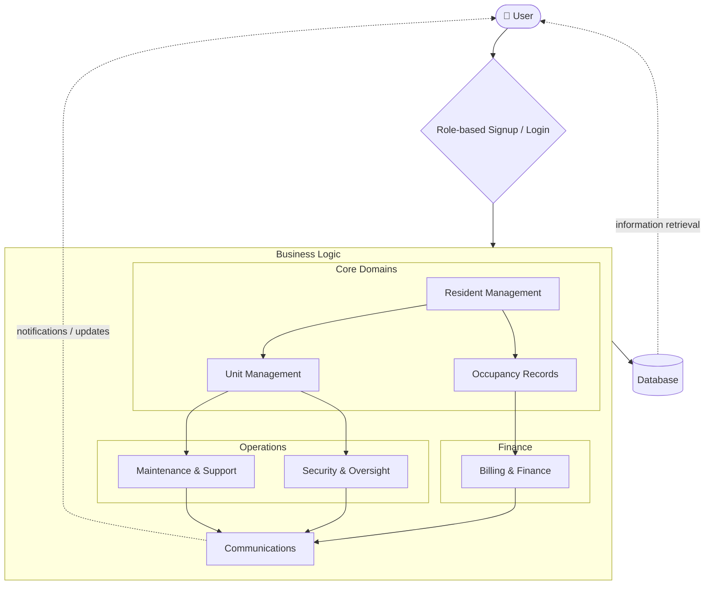

---

# CMSC 129 Project

### Group Members:
* *Kent Francis Genilo*
* *Angel May Janiola*
* *Jasmine Magadan*
* *Eleah Joy Melchor*
* *Mae Maricar Yap*

---

> [!NOTE]
> Hello guys! Naghimo ko gali env file para sa url kag anon key kang supabase ta.
> 
> Also nagsend na ko gali invitations in case need niyo iaccess aton supabase. 
> Kindly check your up mails na lang.
> 
> As for the details and prereq to run main.dart without error, 
> please refer to `.env.example` which will serve as our template.

# Logical View Diagram

### Description

{App Name} is a mobile application built with Flutter and Dart. It allows **condo managers** to manage residents, units, and occupancy records. **Managers** can generate bills for residents and broadcast announcements for maintenance and security notices. **Residents** can receive push notifications, pay their dues, view their payment history, and receive security notices. The system uses **Supabase** as its backend for authentication, database storage, and real-time updates.
## Logical View Diagram
> [!NOTE]
> The diagram below is rendered using **Mermaid.js**. For the best viewing experience, please view this file on GitHub or a Markdown editor with Mermaid support.

## Logical View Diagram Description
Given the diagram above, the functional flow is explained below:
---
### 1. Entry & Authentication
* **Role-Based Access Control (RBAC):**
    * **Manager Signup:** Requires condo registration, generating a unique **6-digit code** for the property.
    * **Resident Signup:** Requires the 6-digit code provided by the manager to link the resident to the property.
    * **Role-based Dashboard:** Flutter dynamically renders the dashboard and UI elements based on the user's role and updates them with real-time data.
* **Supabase Authentication:**
    * Authenticates via email and password.
    * The system dynamically determines if the user is a manager or resident by querying Supabase storage metadata.

### 2. Business Logic Layer
#### **A. Core Domains (Manager Restricted)**
* **Resident Management:** Overview of resident profiles, approval/rejection of pending registrations, and removal of vacated residents.
* **Unit Management:** Monitoring of unit/room availability; acts as the prerequisite for maintenance and security tickets.
* **Occupancy Records:** Tracks active residency, which serves as the trigger for automated billing cycles.

#### **B. Operations & Finance**
* **Maintenance & Support:** A request-response pipeline where residents submit repair issues for manager resolution.
* **Security & Oversight:** Centralized log for incident reporting and property monitoring.
* **Billing & Finance:** Managers generate invoices; residents can view and settle payments directly in-app.

#### **C. Communications**
* **Messaging Service:** Facilitates interaction for maintenance and support inquiries.
* **Broadcast Service:** Allows managers to send property-wide announcements (e.g., maintenance or security notices).

### 3. Data & Feedback (Persistence Layer)
* **Supabase & PostgreSQL:** All logic data is stored in PostgreSQL for persistent storage.
* **Row Level Security (RLS):** Ensures data isolation—users can only access records belonging to their specific property.
* **Real-time Database:** Powers emergency alerts, instant messaging, and financial updates.
* **Push Notifications:** Provides urgent updates for payments or security alerts once data is saved in Supabase.


# Software Architecture

### Architecture Pattern

Feature-First Architecture with Layered Data Access

The system follows a Feature-First architecture where code is organized by business capability instead of technical type. Each feature contains its own UI and logic. Shared data logic is placed in a centralized data layer.

## Structure Layers

```
Presentation Layer
  * Pages
  * Widgets
  * Role-based UI (Tenant, Manager)

Feature Layer
  * Auth
  * Resident
  * Manager

Data Layer
  * Models
  * Repositories
  * Supabase integration
```

---

# Project Structure

```
App-Title/
└── lib/
    ├── data/
    │   ├── models/            # Blueprints: Converts Supabase JSON to Dart Objects
    │   └── repositories/      # Logic: Supabase functions (Auth, CRUD, etc.)
    │
    ├── features/              # Business Logic & UI grouped by feature
    │   ├── auth/              # Login, Signup, Forgot Password
    │   │   ├── pages/         # Full-screen widgets
    │   │   └── widgets/       # Small, reusable auth-only components
    │   │
    │   ├── resident/          # Logic specific to the Tenant role
    │   │   ├── pages/
    │   │   └── widgets/
    │   │
    │   └── manager/           # Logic specific to the Manager role
    │       ├── pages/
    │       └── widgets/
    │
    ├── app.dart               # Global app settings (Theming, Route generation)
    └── main.dart              # Root: App entry point & Supabase initialization
```
