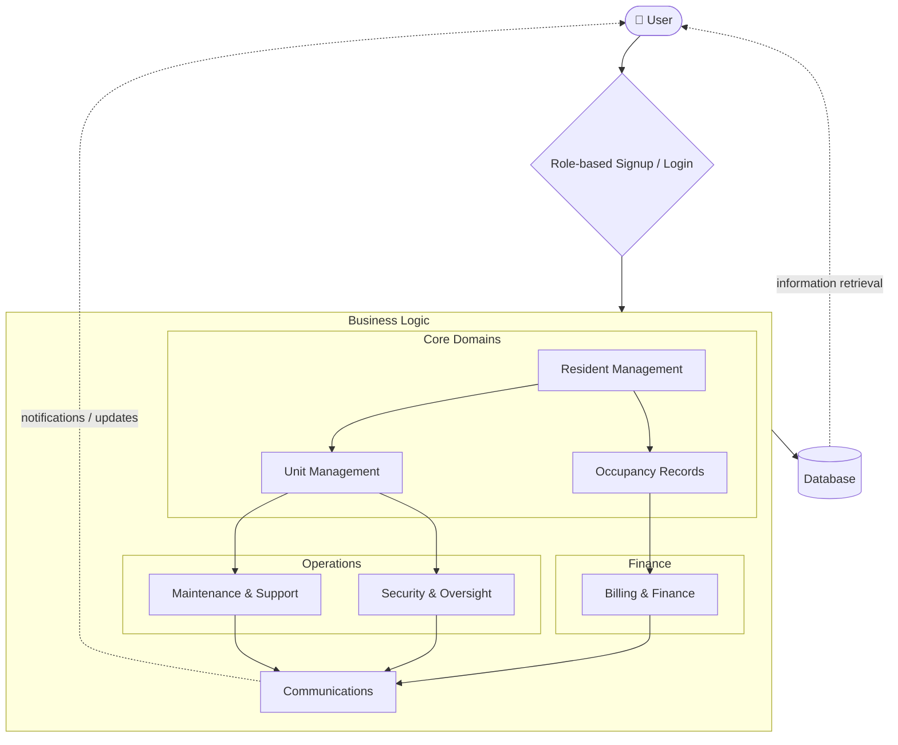
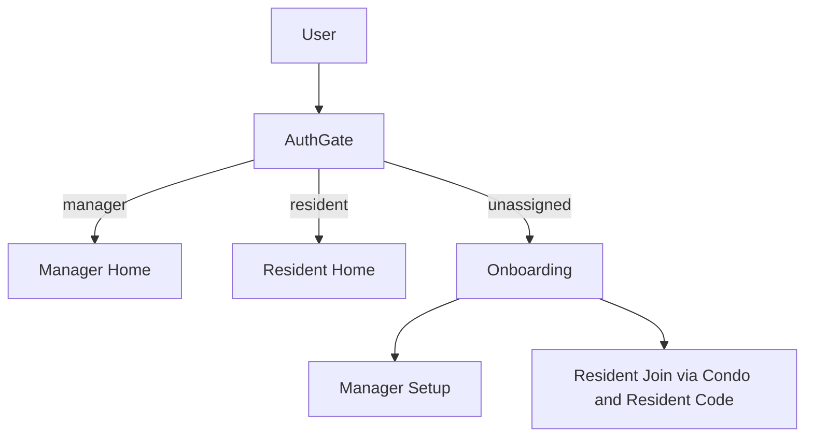
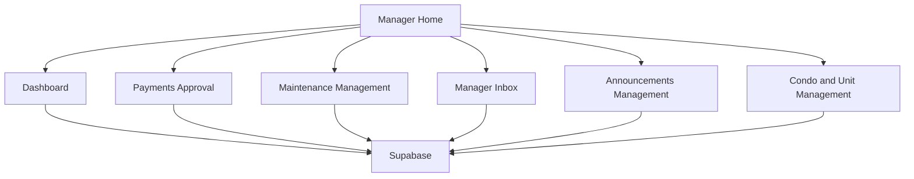
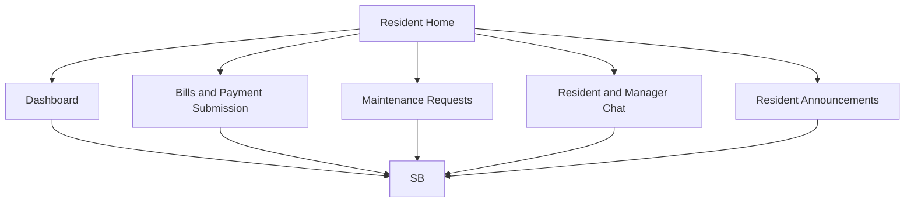
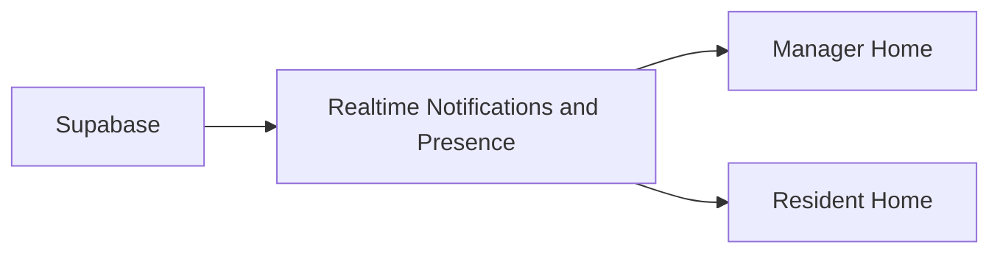

# myCondo

myCondo is a Flutter condo management app for property managers and residents.  
It uses Supabase for auth, Postgres data, role-based access control, and realtime updates.

## Current App State

### Auth and onboarding

- Email/password login and signup.
- Signup creates the auth account immediately, then routes users with role `unassigned` into onboarding.
- Onboarding no longer depends on in-memory pending credentials; it requires an active auth session.
- Role-based routing via `AuthGate`:
  - `manager` -> manager home
  - `resident` -> resident home
  - `unassigned` -> onboarding flow
- Onboarding supports:
  - Manager setup (first name, last name, condo name)
  - Resident claim/join flow using Condo code + resident code
- Password recovery is managed from the in-app Profile page:
  - `Verify Email for Recovery` opens a PIN flow where the user explicitly taps `Send code`.
  - Users can request another PIN after a 60-second cooldown.
  - After successful verification, the app sends the recovery email.
- Current local Supabase config (`supabase/config.toml`) has `auth.email.enable_confirmations = false`, so signup usually authenticates immediately. If confirmations are enabled in a deployed project, signup shows verify-email guidance and redirects to login.

### Manager experience

- Home shell with 5 tabs: dashboard, transactions, inbox, condo about, profile.
- Dashboard includes:
  - property snapshot (units, residents, payments to review, occupancy)
  - latest announcements preview
  - quick actions for residents, units, payments, bills, and maintenance
- Resident management:
  - grouped by unit
  - add/edit/vacate flows
  - resident details and per-resident bill context
- Condo/unit management:
  - manage condo/unit profile data and monthly billing context
- Billing and payments:
  - create bills
  - approve/deny submitted payments
  - denial requires a reason
  - approvals update bill balances/status (`unpaid` / `partial` / `paid`)
- Transaction history for processed payments.
- Announcements:
  - create/edit/delete
  - visibility windows and category/priority support
- Maintenance requests:
  - status tabs (`pending`, `in_progress`, `resolved`, `cancelled`)
  - manager notes and status updates
- Messaging:
  - manager inbox for resident conversations
  - unread indicators
- Editable Condo About page (image, name, location, description, gallery URLs).

### Resident experience

- Home shell with 5 tabs: dashboard, payment history, chat, condo about, profile.
- Dashboard includes:
  - amount due
  - open bills
  - next due date
  - overdue count
  - quick actions (bill breakdown, unit bill, pay bill, maintenance)
- Bill and payment flow:
  - resident can submit bill payments
  - amount validation against outstanding balance
  - proof/reference required
  - method captured in remark (GCash, Cash, Bank Transfer, Scanned QR, Upload QR)
  - pending/approved/rejected feedback on bills
- Payment history view for paid bills.
- Unit bill and bill-breakdown pages.
- Announcements:
  - resident list view
  - supports acknowledgement for announcements that require ack
- Maintenance requests:
  - create requests
  - track status across `pending`, `in_progress`, `resolved`, `cancelled`
  - view manager notes
- Messaging with manager.
- Read-only Condo About page.
- Resident profile actions including logout and maintenance/chat shortcuts.

## Realtime and session behavior

- Realtime in-app notifications (Supabase stream-based) for:
  - new payment submissions (manager)
  - payment decisions (resident)
  - maintenance request updates
  - new announcements (resident)
- Unread badges for chat and action-based notifications.
- Presence tracking for online profiles.
- Login includes a `Keep me signed in` option with explicit mobile session rules:
  - `Checked`:
    - Session is remembered across app restarts (`AuthGate` keeps the session).
    - Inactivity timer is disabled.
    - Device push token stays bound to the signed-in profile until explicit logout.
  - `Unchecked`:
    - Session is valid only for the current app run.
    - On next app launch, `AuthGate` clears any leftover session and sends user to login.
    - Inactivity timer remains active:
      - manager: 10 minutes
      - resident: 15 minutes
    - Device push token is deactivated when the session is cleared.
- Explicit logout always:
  - signs out the Supabase session
  - clears `Keep me signed in` preference
  - deactivates push tokens for the current device/profile

## Known Limitations / Out of Scope

- No external payment gateway integration yet (manual submission + manager approval flow).
- Payment proof is text/reference/link entry only (no in-app file upload pipeline yet).
- Demo credentials are not public in this repo; ask the maintainer.
- Some screens depend on seeded data to be meaningful (`docs/DEMO.md`).

## Tech Stack

- Flutter + Dart
- Supabase Auth
- Supabase Postgres
- Supabase Realtime
- Supabase Row Level Security (RLS)
- Flutter compile-time configuration via `--dart-define-from-file`
- Firebase Cloud Messaging (Android + iOS via APNs)
- Supabase Edge Functions (push dispatch)

## Run Options

### Option A: Hosted web build

- URL: https://innovatxch.github.io/myCondo/
- Credentials: ask the maintainer
- Demo seed reference: `docs/DEMO.md`

Release configuration is injected by GitHub Actions from repository secrets. The workflow writes an ignored `.env` file during CI and passes it to Flutter with:

```bash
flutter build web --release --base-href "/myCondo/" --dart-define-from-file=.env
```

Required GitHub repository secrets:

```env
SUPABASE_URL=...
SUPABASE_ANON_KEY=...
FIREBASE_WEB_API_KEY=...
FIREBASE_WEB_APP_ID=...
FIREBASE_MESSAGING_SENDER_ID=...
FIREBASE_WEB_PROJECT_ID=...
FIREBASE_WEB_AUTH_DOMAIN=...
FIREBASE_WEB_STORAGE_BUCKET=...
FIREBASE_WEB_MEASUREMENT_ID=...
FIREBASE_WEB_VAPID_KEY=...
```

### Option B: Local run

1. Install Flutter SDK and platform tooling (Android Studio/Xcode as needed).
2. For Android builds, use JDK 17.
3. Create `.env` from `.env.example`.
4. Set:

```env
SUPABASE_URL=your_supabase_project_url
SUPABASE_ANON_KEY=your_supabase_anon_key
```

5. Install dependencies:

```bash
flutter pub get
```

6. Run app:

```bash
flutter run --dart-define-from-file=.env
```

7. Optional targets:

```bash
flutter run -d chrome --dart-define-from-file=.env
flutter run -d android --dart-define-from-file=.env
```

## Public Repo Security Checklist

Before contributing, read the secure setup guide:

- `docs/SECURITY_SETUP.md`

Quick rules:
- Never commit `.env`, `android/app/google-services.json`, or `ios/Runner/GoogleService-Info.plist`
- Use project-local credentials only
- Rotate any key immediately if it was exposed in a public commit
- Android launcher and launch-screen source artwork lives in `assets/images/app-icon.png`.

## Push Notification Setup (Android + Web, iOS ready)

This app now supports push notifications for:
- manager: resident payment submissions, maintenance submissions
- resident: payment decisions, maintenance status updates, announcements, messages

### 1) Firebase project setup

1. Create a Firebase project.
2. Add Android app package (`com.example.mycondo` unless changed).
3. Download `google-services.json` and place it in `android/app/google-services.json`.
4. (iOS ready) Add iOS app in Firebase and download `GoogleService-Info.plist` for `ios/Runner/GoogleService-Info.plist`.
5. Add a Firebase **Web app** and copy its config object values + Web Push certificate key pair (VAPID key).

### 2) Web config values

Set these in `.env` (see `.env.example`):

```env
FIREBASE_WEB_API_KEY=...
FIREBASE_WEB_APP_ID=...
FIREBASE_MESSAGING_SENDER_ID=...
FIREBASE_WEB_PROJECT_ID=...
FIREBASE_WEB_AUTH_DOMAIN=...
FIREBASE_WEB_STORAGE_BUCKET=...
FIREBASE_WEB_MEASUREMENT_ID=...
FIREBASE_WEB_VAPID_KEY=...
```

Update placeholders in `web/firebase-messaging-sw.js` with the same Firebase web config values.

### 3) APNs (for iOS push delivery)

1. In Apple Developer, create APNs auth key or certificate.
2. Upload APNs credentials in Firebase Cloud Messaging for your iOS app.
3. Enable Push Notifications capability in Xcode target `Runner` when testing on iOS device.

### 4) Supabase migration + function

Run migrations and deploy the push edge function:

```bash
supabase db push
supabase functions deploy send-push-event
```

Set required function secrets:

```bash
supabase secrets set FIREBASE_SERVICE_ACCOUNT_JSON='{"type":"service_account",...}'
supabase secrets set FIREBASE_PROJECT_ID='your-firebase-project-id'
```

`FIREBASE_SERVICE_ACCOUNT_JSON` must be a full JSON service account with Firebase Messaging API access.

### 5) Test flow (mobile + web)

1. Login as resident, allow notification permission, submit payment and maintenance request.
2. Login as manager on another device/session, approve/reject payment and update maintenance status.
3. Create an announcement and send chat messages.
4. Verify push arrives when recipient app is backgrounded/closed (or browser tab not focused for web).
5. Logout and confirm new pushes for that profile stop on that device.

### 6) Preference behavior

- Push dispatch checks `notification_preferences` (when saved) for:
  - `payment_reminders`
  - `announcement_alerts`
  - `maintenance_updates`
  - `message_alerts`
  - `allow_manager_messages`
- If no preference row exists yet, defaults are treated as enabled.

### 7) Hosting note for GitHub Pages

- If the app is hosted under a subpath (example: `/myCondo/`), ensure `web/firebase-messaging-sw.js` is publicly served and the browser successfully registers it.
- Web push requires HTTPS and a browser that supports service workers + notifications.

## Important Status Values

### `payments.status`

- `pending` -> submitted by resident, waiting for manager review
- `completed` -> approved by manager and applied to bill
- `rejected` -> denied by manager with `rejection_reason`

### `bills.status`

- `unpaid`
- `partial`
- `paid`

### `maintenance_requests.status`

- `pending`
- `in_progress`
- `resolved`
- `cancelled`

## Project Structure

```text
lib/
  app.dart
  app_routes.dart
  main.dart
  data/
    models/
      manager/
      shared/
    repositories/
      auth/
      manager/
      onboarding/
      resident/
      shared/
  features/
    auth/
    manager/
      pages/
      widgets/
    resident/
      pages/
    shared/
      pages/
      widgets/
  services/
    push/
    shared/
  theme/
  utils/
docs/
  DEMO.md
supabase_public_dump.sql
```

## Architecture

- `features/` contains role-based UI and app flows.
- `data/models/` defines typed domain objects.
- `data/repositories/` encapsulates Supabase reads/writes.
- `services/shared/` contains cross-feature behavior (chat, notifications, presence, session timer).
- Routing is centralized in `app_routes.dart`, with auth/role gate logic in `AuthGate`.


## Logical View Diagram

### Description
 
myCondo is a mobile application built with Flutter and Dart. It allows **condo managers** to manage residents, units, and occupancy records. **Managers** can generate bills for residents and broadcast announcements for maintenance and security notices. **Residents** can receive push notifications, submit payment details/proof/reference for manager review, view their payment history, and receive security notices. The system uses **Supabase** as its backend for authentication, database storage, and real-time updates.

### Diagram
> [!NOTE]
> The diagram below is rendered using **Mermaid.js**. For the best viewing experience, please view this file on GitHub or a Markdown editor with Mermaid support.

```mermaid
flowchart TD

USER(["👤 User"]) 
    
    AUTHGATE{Role-based Signup / Login}
    
    subgraph LOGIC["Business Logic"]
        direction TB
            COMMS["Communications"]
        
            subgraph FINANCE["Finance"]
                BILLING["Billing & Finance"]
            end

            subgraph OPERATIONS["Operations"]
                SUPPORT["Maintenance & Support"]
                SECURITY["Security & Oversight"]
            end

            subgraph CORE["Core Domains"]
                direction TB
                RES_MANAGE["Resident Management"]
                UNIT_MANAGE["Unit Management"]
                RECORDS["Occupancy Records"]
            end 
    end
    
    DB[("Database")]


    RES_MANAGE --> UNIT_MANAGE
    RES_MANAGE --> RECORDS

    RECORDS --> BILLING
    UNIT_MANAGE --> SUPPORT
    UNIT_MANAGE --> SECURITY
    
    BILLING --> COMMS
    SECURITY --> COMMS
    SUPPORT --> COMMS

    USER --> AUTHGATE
    AUTHGATE --> LOGIC
    LOGIC --> DB

    DB -.-> |information retrieval| USER
    COMMS -.-> |notifications / updates| USER
```
## Logical View Diagram Description
Given the diagram above, the functional flow is explained below:
---
### 1. Entry & Authentication
* **Role-Based Access Control (RBAC):**
  * **Manager Signup:** Requires condo registration, generating a unique **8-digit code** for the property.
  * **Resident Signup:** Requires the 8-digit code provided by the manager to link the resident to the property.
  * **Role-based Dashboard:** Flutter dynamically renders the dashboard and UI elements based on the user's role and updates them with real-time data.
* **Supabase Authentication:**
  * Authenticates via email and password.
  * The system dynamically determines if the user is a manager or resident by querying Supabase storage metadata which contains profiles table and role-based profile records.

### 2. Business Logic Layer
#### **A. Core Domains (Manager Restricted)**
* **Resident Management:** Overview of resident profiles, approval/rejection of pending registrations, and removal of vacated residents.
* **Unit Management:** Monitoring of unit/room availability; acts as the prerequisite for maintenance and security tickets.
* **Occupancy Records:** Tracks active residency, which serves as the trigger for manager-created bills and fees.

#### **B. Operations & Finance**
* **Maintenance & Support:** A request-response pipeline where residents submit repair issues for manager resolution.
* **Security & Oversight:** Centralized log for incident reporting and property monitoring.
* **Billing & Finance:** Managers generate invoices; residents can view and ubmit payment details/proof/reference for manager review.

#### **C. Communications**
* **Messaging Service:** Facilitates interaction for maintenance and support inquiries.
* **Broadcast Service:** Allows managers to send property-wide announcements (e.g., maintenance or security notices).

### 3. Data & Feedback (Persistence Layer)
* **Supabase & PostgreSQL:** All logic data is stored in PostgreSQL for persistent storage.
* **Row Level Security (RLS):** Ensures data isolation—users can only access records belonging to their specific property.
* **Real-time Database:** Powers emergency alerts, instant messaging, and financial updates.
* **Push Notifications:** Provides urgent updates for payments or security alerts once data is saved in Supabase.


# Software Architecture

### Architecture Pattern

Feature-First Architecture with Layered Data Access

The system follows a Feature-First architecture where code is organized by business capability instead of technical type. Each feature contains its own UI and logic. Shared data logic is placed in a centralized data layer.

## Structure Layers

```
Presentation Layer
  * Pages
  * Widgets
  * Role-based UI (Resident, Condo Manager)

Feature Layer
  * Auth
  * Resident
  * Manager

Data Layer
  * Models
  * Repositories
  * Supabase integration
```

---


## System Flow (Mermaid)

### 1) Auth and onboarding


```mermaid
flowchart TD
  U["User"] --> AG["AuthGate"]
  AG -->|manager| MH["Manager Home"]
  AG -->|resident| RH["Resident Home"]
  AG -->|unassigned| OB["Onboarding"]

  OB --> MS["Manager Setup"]
  OB --> RS["Resident Join via Condo and Resident Code"]
```

### 2) Manager feature flow


```mermaid
flowchart TD
  MH["Manager Home"] --> MD["Dashboard"]
  MH --> MP["Payments Approval"]
  MH --> MM["Maintenance Management"]
  MH --> MI["Manager Inbox"]
  MH --> MA["Announcements Management"]
  MH --> MC["Condo and Unit Management"]

  MD --> SB["Supabase"]
  MP --> SB
  MM --> SB
  MI --> SB
  MA --> SB
  MC --> SB
```

### 3) Resident feature flow


```mermaid
flowchart TD
  RH["Resident Home"] --> RD["Dashboard"]
  RH --> RB["Bills and Payment Submission"]
  RH --> RM["Maintenance Requests"]
  RH --> RI["Resident and Manager Chat"]
  RH --> RA["Resident Announcements"]

  RD --> SB
  RB --> SB
  RM --> SB
  RI --> SB
  RA --> SB
```

### 4) Realtime loop


```mermaid
flowchart LR
  SB["Supabase"] --> RT["Realtime Notifications and Presence"]
  RT --> MH["Manager Home"]
  RT --> RH["Resident Home"]
```

## User Manual / Demo Data

- See `docs/DEMO.md` for sample accounts, condo code, resident codes, and sample records.

## Group Members

- Kent Francis Genilo
- Angel May Janiola
- Jasmine Magadan
- Eleah Joy Melchor
- Mae Maricar Yap
