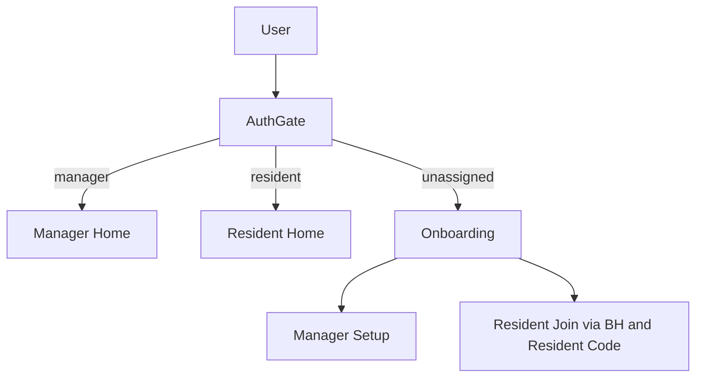
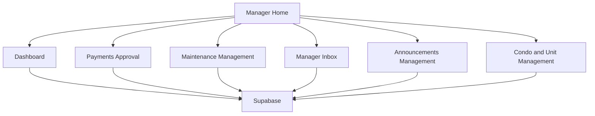
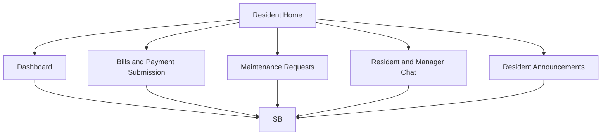
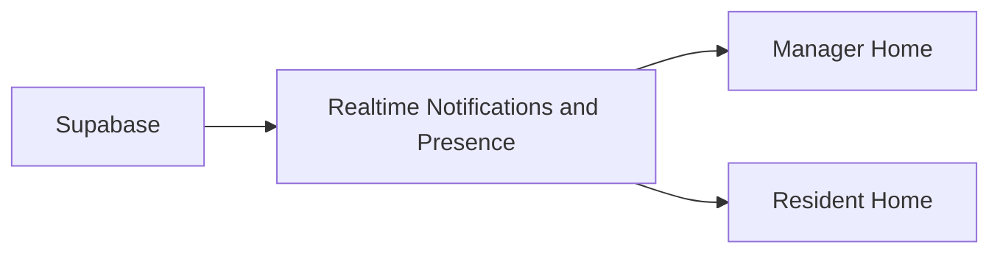

# myCondo

myCondo is a Flutter condo management app for property managers and residents.  
It uses Supabase for auth, Postgres data, role-based access control, and realtime updates.

## Current App State

### Auth and onboarding

- Email/password login and signup.
- Role-based routing via `AuthGate`:
  - `manager` -> manager home
  - `resident` -> resident home
  - `unassigned` -> onboarding flow
- Onboarding supports:
  - Manager setup (first name, last name, condo name)
  - Resident claim/join flow using BH code + resident code

### Manager experience

- Home shell with 5 tabs: dashboard, transactions, inbox, condo about, profile.
- Dashboard includes:
  - property snapshot (units, residents, payments to review, occupancy)
  - latest announcements preview
  - quick actions for residents, units, payments, bills, and maintenance
- Resident management:
  - grouped by unit
  - add/edit/vacate flows
  - resident details and per-resident bill context
- Condo/unit management:
  - manage condo/unit profile data and monthly billing context
- Billing and payments:
  - create bills
  - approve/deny submitted payments
  - denial requires a reason
  - approvals update bill balances/status (`unpaid` / `partial` / `paid`)
- Transaction history for processed payments.
- Announcements:
  - create/edit/delete
  - visibility windows and category/priority support
- Maintenance requests:
  - status tabs (`pending`, `in_progress`, `resolved`, `cancelled`)
  - manager notes and status updates
- Messaging:
  - manager inbox for resident conversations
  - unread indicators
- Editable Condo About page (image, name, location, description, gallery URLs).

### Resident experience

- Home shell with 5 tabs: dashboard, payment history, chat, condo about, profile.
- Dashboard includes:
  - amount due
  - open bills
  - next due date
  - overdue count
  - quick actions (bill breakdown, unit bill, pay bill, maintenance)
- Bill and payment flow:
  - resident can submit bill payments
  - amount validation against outstanding balance
  - proof/reference required
  - method captured in remark (GCash, Cash, Bank Transfer, Scanned QR, Upload QR)
  - pending/approved/rejected feedback on bills
- Payment history view for paid bills.
- Unit bill and bill-breakdown pages.
- Announcements:
  - resident list view
  - supports acknowledgement for announcements that require ack
- Maintenance requests:
  - create requests
  - track status across `pending`, `in_progress`, `resolved`, `cancelled`
  - view manager notes
- Messaging with manager.
- Read-only Condo About page.
- Resident profile actions including logout and maintenance/chat shortcuts.

## Realtime and session behavior

- Realtime in-app notifications (Supabase stream-based) for:
  - new payment submissions (manager)
  - payment decisions (resident)
  - maintenance request updates
  - new announcements (resident)
- Unread badges for chat and action-based notifications.
- Presence tracking for online profiles.
- Login includes a `Keep me signed in` option with explicit mobile session rules:
  - `Checked`:
    - Session is remembered across app restarts (`AuthGate` keeps the session).
    - Inactivity timer is disabled.
    - A persistent device/profile push-session binding is stored until explicit logout.
  - `Unchecked`:
    - Session is valid only for the current app run.
    - On next app launch, `AuthGate` clears any leftover session and sends user to login.
    - Inactivity timer remains active:
      - manager: 10 minutes
      - resident: 15 minutes
    - Persistent device/profile push-session binding is cleared.
- Explicit logout always:
  - signs out the Supabase session
  - clears `Keep me signed in` preference
  - clears device/profile push-session binding metadata

## Known Limitations / Out of Scope

- No external payment gateway integration yet (manual submission + manager approval flow).
- Payment proof is text/reference/link entry only (no in-app file upload pipeline yet).
- Notifications are in-app realtime badges/popups; push notifications are not configured.
- Demo credentials are not public in this repo; ask the maintainer.
- Some screens depend on seeded data to be meaningful (`docs/DEMO.md`).

## Tech Stack

- Flutter + Dart
- Supabase Auth
- Supabase Postgres
- Supabase Realtime
- Supabase Row Level Security (RLS)
- `flutter_dotenv` for local env config

## Run Options

### Option A: Hosted web build

- URL: https://innovatxch.github.io/myCondo/
- Credentials: ask the maintainer
- Demo seed reference: `docs/DEMO.md`

### Option B: Local run

1. Install Flutter SDK and platform tooling (Android Studio/Xcode as needed).
2. For Android builds, use JDK 17.
3. Create `.env` from `.env.example`.
4. Set:

```env
SUPABASE_URL=your_supabase_project_url
SUPABASE_ANON_KEY=your_supabase_anon_key
```

5. Install dependencies:

```bash
flutter pub get
```

6. Run app:

```bash
flutter run
```

7. Optional targets:

```bash
flutter run -d chrome
flutter run -d android
```

## Important Status Values

### `payments.status`

- `pending` -> submitted by resident, waiting for manager review
- `completed` -> approved by manager and applied to bill
- `rejected` -> denied by manager with `rejection_reason`

### `bills.status`

- `unpaid`
- `partial`
- `paid`

### `maintenance_requests.status`

- `pending`
- `in_progress`
- `resolved`
- `cancelled`

## Project Structure

```text
lib/
  app.dart
  app_routes.dart
  main.dart
  data/
    models/
      manager/
      shared/
    repositories/
      auth/
      manager/
      onboarding/
      resident/
      shared/
  features/
    auth/
    manager/
      pages/
      widgets/
    resident/
      pages/
    shared/
      pages/
      widgets/
  services/
    shared/
  theme/
  utils/
docs/
  DEMO.md
supabase_public_dump.sql
```

## Architecture

- `features/` contains role-based UI and app flows.
- `data/models/` defines typed domain objects.
- `data/repositories/` encapsulates Supabase reads/writes.
- `services/shared/` contains cross-feature behavior (chat, notifications, presence, session timer).
- Routing is centralized in `app_routes.dart`, with auth/role gate logic in `AuthGate`.

## System Flow (Mermaid)

### 1) Auth and onboarding


```mermaid
flowchart TD
  U["User"] --> AG["AuthGate"]
  AG -->|manager| MH["Manager Home"]
  AG -->|resident| RH["Resident Home"]
  AG -->|unassigned| OB["Onboarding"]

  OB --> MS["Manager Setup"]
  OB --> RS["Resident Join via BH and Resident Code"]
```

### 2) Manager feature flow


```mermaid
flowchart TD
  MH["Manager Home"] --> MD["Dashboard"]
  MH --> MP["Payments Approval"]
  MH --> MM["Maintenance Management"]
  MH --> MI["Manager Inbox"]
  MH --> MA["Announcements Management"]
  MH --> MC["Condo and Unit Management"]

  MD --> SB["Supabase"]
  MP --> SB
  MM --> SB
  MI --> SB
  MA --> SB
  MC --> SB
```

### 3) Resident feature flow


```mermaid
flowchart TD
  RH["Resident Home"] --> RD["Dashboard"]
  RH --> RB["Bills and Payment Submission"]
  RH --> RM["Maintenance Requests"]
  RH --> RI["Resident and Manager Chat"]
  RH --> RA["Resident Announcements"]

  RD --> SB
  RB --> SB
  RM --> SB
  RI --> SB
  RA --> SB
```

### 4) Realtime loop


```mermaid
flowchart LR
  SB["Supabase"] --> RT["Realtime Notifications and Presence"]
  RT --> MH["Manager Home"]
  RT --> RH["Resident Home"]
```

## User Manual / Demo Data

- See `docs/DEMO.md` for sample accounts, condo code, resident codes, and sample records.

## Group Members

- Kent Francis Genilo
- Angel May Janiola
- Jasmine Magadan
- Eleah Joy Melchor
- Mae Maricar Yap
