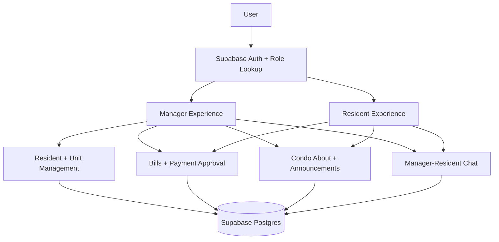

# myCondo

myCondo is a Flutter condo management app for property managers and residents. It uses Supabase for authentication, PostgreSQL data storage, and role-based access to condo, billing, resident, announcement, and messaging data.

## Table of Contents

- [Current App State](#current-app-state)
- [Known Limitations / Out of Scope (Current)](#known-limitations--out-of-scope-current)
- [Run Options](#run-options)
- [Tech Stack](#tech-stack)
- [Important Payment Status Values](#important-payment-status-values)
- [Project Structure](#project-structure)
- [Architecture](#architecture)
- [User Manual](#user-manual)
- [Group Members](#group-members)

## Group Members

- Kent Francis Genilo
- Angel May Janiola
- Jasmine Magadan
- Eleah Joy Melchor
- Mae Maricar Yap

## Current App State

### Manager Side

- Dashboard with manager greeting, summary cards (residents, units, payments to review, capacity used), highlighted announcements, and quick actions.
- Resident management with unit grouping, resident profiles, add/edit/vacate flows, and resident detail pages.
- Bill creation for selected residents or units.
- Per-resident bill management from resident details.
- Announcements with create, edit, delete, and category styling.
- Payment approval queue backed by Supabase:
  - approve confirmation before applying payment
  - deny flow requiring a rejection reason
  - approved payments update bill status to `partial` or `paid`
- Transaction history showing processed payments, both approved and denied.
- Inbox/chat entry point for manager-resident conversations.
- Editable condo About page:
  - condo image
  - condo name and location
  - description
  - gallery image URLs

### Resident Side

- Resident dashboard with amount due summary.
- Resident metrics for open bills, next due date, and overdue bills.
- Bills list and bill details view (read-only).
- Payment history (read-only, for completed/approved payments recorded in the system).
- Read-only announcements page.
- Manager chat entry point.
- Read-only condo About page.
- Resident profile and logout.

## Known Limitations / Out of Scope (Current)

- Resident online payments are not integrated (no real payment gateway / GCash API integration yet).
- Demo credentials are not publicly listed in the repo (ask the maintainer for access).
- Some flows require seeded/demo data in Supabase to avoid empty dashboards and lists.

## Tech Stack

- Flutter
- Dart
- Supabase Auth
- Supabase Postgres
- Supabase Row Level Security

## Run Options

### Option A: Use the Web Deployment (Fastest)

- Open: https://innovatxch.github.io/myCondo/
- Demo credentials: Ask the maintainer for credentials.
- Demo seed data reference: `docs/DEMO.md`

### Option B: Run Locally (Full Flutter Setup)

1. Install Flutter and Android tooling.
2. Use a supported JDK for Android builds, preferably JDK 17.
3. Create a `.env` file from `.env.example`.
4. Add your Supabase values:

```env
SUPABASE_URL=your_supabase_project_url
SUPABASE_ANON_KEY=your_supabase_anon_key
```

5. Install dependencies:

```bash
flutter pub get
```

6. Run the app:

```bash
flutter run
```

#### Run Locally (Web)

```bash
flutter run -d chrome
```

#### Run Locally (Android)

```bash
flutter run -d android
```

## Important Payment Status Values

The app expects `payments.status` to use:

- `pending` - submitted by resident, waiting for manager review
- `completed` - approved by manager and counted toward bill balance
- `rejected` - denied by manager, with `rejection_reason`

Bill status uses:

- `unpaid`
- `partial`
- `paid`

## Project Structure

```text
lib/
  app.dart
  main.dart
  data/
    models/
      manager/
      shared/
    repositories/
      auth/
      manager/
      onboarding/
      resident/
      shared/
  features/
    auth/
    manager/
      pages/
      widgets/
    resident/
      pages/
    shared/
      pages/
      widgets/
  services/
    shared/
  utils/
```

## Architecture

The app follows a feature-first structure with a shared data layer:

- `features/` contains role-specific and shared UI.
- `data/models/` contains Dart models for Supabase rows.
- `data/repositories/` contains Supabase queries and mutations.
- `services/` contains cross-feature services such as chat.

## User Manual

For basic demo steps (accounts, condo codes, sample residents, and sample bills), see `docs/DEMO.md`.

## Logical View


```mermaid
flowchart TD
  User["User"]
  Auth["Supabase Auth + Role Lookup"]
  Manager["Manager Experience"]
  Resident["Resident Experience"]
  Condo["Condo About + Announcements"]
  Residents["Resident + Unit Management"]
  Billing["Bills + Payment Approval"]
  Chat["Manager-Resident Chat"]
  DB[("Supabase Postgres")]

  User --> Auth
  Auth --> Manager
  Auth --> Resident
  Manager --> Residents
  Manager --> Billing
  Manager --> Condo
  Manager --> Chat
  Resident --> Billing
  Resident --> Condo
  Resident --> Chat
  Residents --> DB
  Billing --> DB
  Condo --> DB
  Chat --> DB
```
